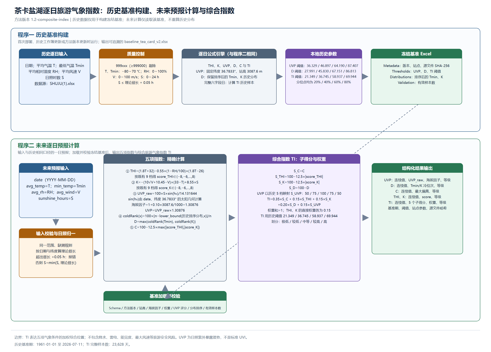

# 茶卡盐湖旅游气象指数

本项目以茶卡国家基准气候站的逐日历史观测构建本地基准，再接收一日天气预报并输出五项旅游气象指数。

> 当前规则是第一版可运行口径。它只使用用户提供的历史气象工作簿和未来同口径预报字段，不接入外部数据。

## 五项输出

| 输出键 | 指数 | 含义 |
|---|---|---|
| `uvp` | 日照紫外暴露潜势指数 | 按茶卡固定站高 3087.6m 修正的本地相对直接日照暴露潜势；数值可能超过 100，**不是标准 UVI**。 |
| `clothing` | 着装保温需求指数 | 0–100 的相对保温需求；不是衣物毫米厚度或 `clo`。 |
| `comfort` | 人体舒适度 | 未通过加衣调整的原始天气热舒适度。 |
| `thi` | 温湿度指数 | 温度与相对湿度的体感指标。 |
| `wind_effect_k` | 风效指数 | 温度、平均风速和日照时数的综合体感指标。 |

完整定义、数据口径、公式、阈值、已知局限和后续开发事项见 [交接文档](docs/HANDOFF.md)。
五张“输入—质控—计算—分级—输出”流程图及通俗解释见 [指标流程图](docs/LOGIC_FLOWS.md)。
口径逻辑审查、历史试算证据和潜在问题清单见 [逻辑审查](docs/LOGIC_REVIEW.md)。
研究背景、原始资料、决策记录和当前项目状态见 [项目上下文](docs/PROJECT_CONTEXT.md)。
面向日常运行的完整命令、输入格式和常见操作见 [使用说明](docs/USAGE.md)。
如需同时了解代码文件职责、程序运行方式和五项指标的计算逻辑，见 [代码使用与计算逻辑说明](docs/使用说明.md)。
桌面界面程序与单文件 EXE 的使用和重新打包方法见 [界面程序说明](docs/GUI_EXE_USAGE.md)。

## 方法框架图



上图的 PNG 和可编辑 SVG 位于 [`docs/flowcharts/`](docs/flowcharts/README.md)。其中“冻结基准 Excel”是两个程序之间唯一的参数接口。

## 项目结构

| 文件 | 角色 | 是否直接运行 |
|---|---|---|
| `src/build_baseline.py` | 程序一：从历史气象工作簿构建、校验并写出冻结基准 Excel。 | 是；在历史数据或方法版本变化后运行。 |
| `src/calculate_indices.py` | 程序二：读取冻结基准 Excel 与一日预报，输出五项指数 JSON。 | 是；每次需要计算预报时运行。 |
| `src/tourism_indices.py` | 共享规则库：公式、质量控制、分级、基准读写及校验。 | 否；由前两个程序调用。 |

## 安装

```powershell
python -m pip install -r requirements.txt
```

## 两步运行

### 1. 构建并冻结历史基准

历史工作簿只在此步骤使用。程序将历史分布、分位阈值、有效样本数、方法版本和源文件 SHA-256 写入基准 Excel；之后的预报计算不再读取原始历史数据。

```powershell
python .\src\build_baseline.py `
  --history ".\data\SHUJU(1).xlsx" `
  --output .\data\baseline_tea_card_v1.xlsx
```

基准 Excel 包含 `Metadata`、`Thresholds`、`Distributions`、`Validation` 四个工作表。`Distributions` 保存排序后的历史最低气温和 K 分布，以便 D 在任意未来连续输入值下仍可按原规则计算经验冷位次。

### 2. 用冻结基准计算一日预报

未来预报必须与历史工作簿保持同一口径：平均气温（℃）、最低气温（℃）、平均相对湿度（%）、平均 2 分钟风速（m/s）、日照时数（小时）。

```powershell
python .\src\calculate_indices.py `
  --baseline .\data\baseline_tea_card_v1.xlsx `
  --input-json .\examples\forecast.json
```

也可直接输入参数：

```powershell
python .\src\calculate_indices.py `
  --baseline .\data\baseline_tea_card_v1.xlsx `
  --date 2026-07-20 `
  --avg-temp 14.0 `
  --min-temp 6.0 `
  --avg-rh 45 `
  --avg-wind 3.0 `
  --sunshine-hours 10.0
```

输出为 UTF-8 JSON，包含五项指数、分级、基础输入、基准期、分位数阈值和原始历史文件哈希。

日常使用通常只需执行第 2 步；第 1 步仅在历史数据更新或计算口径更新后执行。详细的输入 JSON、输出解释和失败处理见 [使用说明](docs/USAGE.md)。

## 当前数据约束

- 已授权上传的历史源数据位于 `data/SHUJU(1).xlsx`；只在构建基准时通过 `--history` 指定。
- 所有 `>=999000` 的数值被视为缺测。
- UVP 使用固定纬度 36.7833° 和固定站高 3087.6m；海拔仅用于 UVP 的近似修正，THI、K、C、D 不因海拔额外调整。
- `data/baseline_tea_card_v1.xlsx` 是当前历史文件构建出的冻结基准。基准文件会校验结构版本、方法版本、站高与海拔因子；更新历史数据或口径后必须重新构建并升级版本。
- 当前是逐日尺度；不能解释为某一具体小时的体感或辐射水平。
