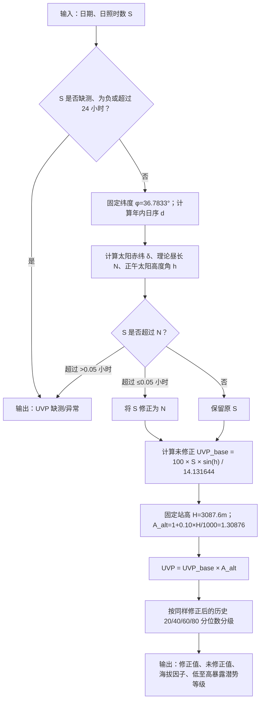
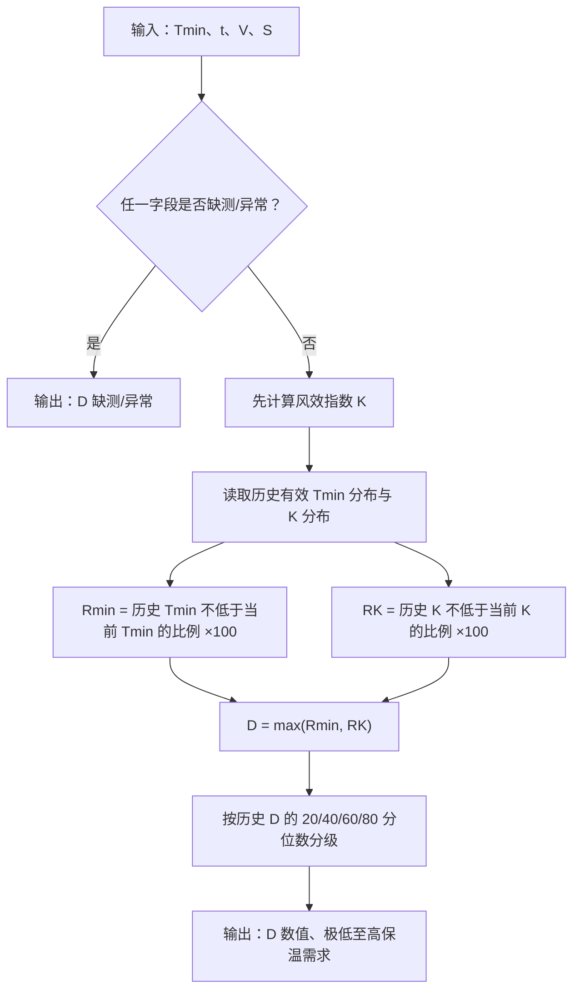
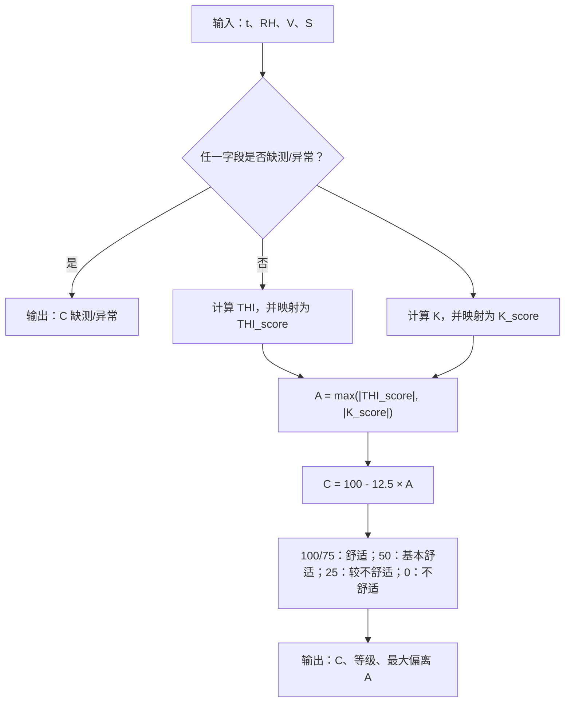
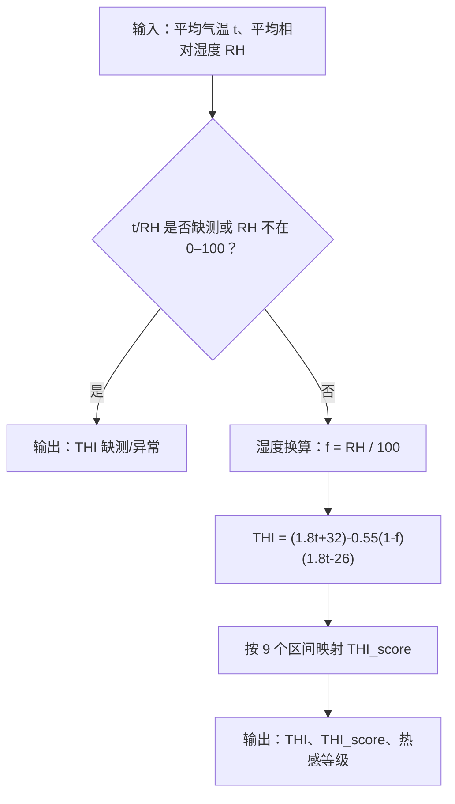
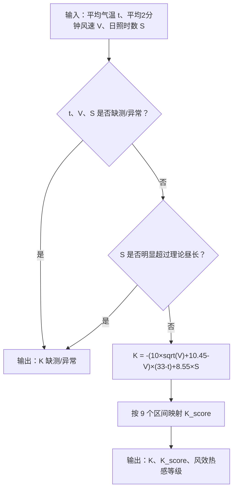

# 五项指标流程图与解释

本文档是给业务人员和下一位开发者阅读的图解版本。每个指标均按同一顺序运行：接收未来某日预报数据、检查是否可用、计算原始值、映射为等级、输出机器可读的数值与中文解释。

对应的含公式 PNG 图已保存于 [`docs/flowcharts/`](flowcharts/README.md)，可直接用于汇报或文档引用。其中 `00-two-program-workflow.png` 用于说明历史基准构建与未来预报计算的两程序关系。

## 共用约定

- 所有输入均为逐日数据，不代表某个具体小时。
- 任何 `>=999000` 的数值都是缺测，不计算。
- `S` 是日照时数（小时），`V` 是平均 2 分钟风速（m/s），`t` 是平均气温（℃），`Tmin` 是最低气温（℃）。
- `RH` 是平均相对湿度（百分数）。在 THI 公式中会先换成比例值 `f=RH/100`。
- 日照时数必须不显著超过由日期和茶卡固定纬度 36.7833° 算出的理论昼长。小于等于 0.05 小时的超出按四舍五入误差修正；超过则拒绝输出。
- UVP 的固定站高为 3087.6m，采用海拔因子 `1.30876`；其余四项指标不作海拔额外修正。

---

## 1. 日照紫外暴露潜势指数（UVP）

**它是什么：** UVP 是按茶卡固定站高 3087.6m 修正的本地相对日照暴露潜势。数值越高，意味着这一天太阳高度更高、有效日照时数更长，且考虑了固定海拔的近似增幅，因此直接日照暴露潜势更大；修正后数值可能超过 100。

**它不是什么：** 它不是标准紫外线指数 UVI。现有数据没有紫外辐射、云量、臭氧和气溶胶，不能估算实际红斑紫外辐射。



计算中的太阳几何关系为：

```text
δ = 23.45° × sin(2π(284+d)/365)
N = (24/π) × arccos(-tan(φ) × tan(δ))
h = arcsin(sin(φ) × sin(δ) + cos(φ) × cos(δ))
UVP_base = 100 × S × sin(h) / 14.131644170491846
A_alt = 1 + 0.10 × 3087.6 / 1000 = 1.30876
UVP = UVP_base × A_alt
```

当前历史阈值为 36.329、46.897、64.190、87.407，对应低、较低、中等、较高、高暴露潜势。历史基准和未来输入均使用同一海拔因子，因此等级仍表示“相对于茶卡历史条件”的位置；它不是国际健康风险分级，也不是标准 UVI。

---

## 2. 着装保温需求指数（D）

**它是什么：** D 是 0–100 的相对保温需求。数值高表示该日的最低气温或日间风效，在茶卡历史中更偏冷，行前应准备更强保温。

**为什么用最低气温和 K：** 最低气温代表一天最冷的暴露风险；K 同时考虑平均气温、平均风速和日照。两者取更高的冷需求，是已经确认的“全天出游、行前保守准备”策略。

**它不是什么：** D 不是衣服的毫米厚度，也不是真实 `clo` 保温值。真实 `clo` 需辐射和人体活动代谢等现有数据没有的变量。



公式如下：

```text
Rmin = 100 × P(Tmin_hist ≥ Tmin)
RK   = 100 × P(K_hist ≥ K)
D    = max(Rmin, RK)
```

`P(...)` 是历史样本中的经验比例。例如当前气温低于大部分历史最低气温时，`Rmin` 接近 100。当前 D 的历史分级阈值为 27.991、45.830、67.151、86.813。

---

## 3. 人体舒适度（C）

**它是什么：** C 表示人在没有额外加衣、遮阳等补偿行为时，天气本身带来的热舒适程度。它是 0、25、50、75、100 五档值，越高越舒适。

**为什么不加 UVP 或降水：** UVP 是独立的暴露风险；降水、雷电和能见度等尚未建立经过确认的规则。直接混入 C 会使“热舒适”与“旅游安全”混为一谈。

**为什么取最不利值：** THI 偏冷而 K 偏热时，不能因为数学相加而抵消成“舒适”。因此 C 取两个体感指标中偏离舒适区更严重的一项。



```text
A = max(abs(THI_score), abs(K_score))
C = 100 - 12.5 × A
```

注意：茶卡历史试算中，不舒适（C=0）的日数较多。这反映高寒天气在“未调整着装”的原始定义下的结果；不能据此推断游客充分保暖后一定不适。

---

## 4. 温湿度指数（THI）

**它是什么：** THI 将平均气温和平均相对湿度合成为一个冷热/闷热体感指标。湿度高会改变人体散热，因此同一温度在不同湿度下 THI 不同。

**它在系统中的作用：** THI 自身作为一项输出；同时提供 `THI_score` 给人体舒适度 C 使用。



THI 区间依次为：`<40`、`40–<45`、`45–<55`、`55–<60`、`60–<65`、`65–<70`、`70–<75`、`75–<80`、`≥80`。对应分值依次是 -8、-6、-4、-2、0、2、4、6、8；负值表示偏冷，正值表示偏热。

---

## 5. 风效指数（K）

**它是什么：** K 将平均气温、平均风速和日照时数合成为一个风—日照—温度体感指标。风会改变散热，日照会改变受热，因此它补充了只看温湿条件的 THI。

**它在系统中的作用：** K 自身作为一项输出；提供 `K_score` 给人体舒适度 C；作为着装保温需求 D 的一个输入。



K 的分段边界为 -1200、-1000、-800、-600、-300、-200、-50、80，对应分值 -8 至 8。未来预报的 `V` 必须是平均 2 分钟风速；最大风速、极大风速或阵风均不可替代。

---

## 五项结果如何一起理解

| 指数 | 回答的问题 | 不应被误解为 |
|---|---|---|
| UVP | 这一天的本地相对直接日照暴露潜势高不高？ | 标准 UVI 或真实紫外辐射强度 |
| D | 行前需要准备多强的保温？ | 衣服的实际厚度或固定服装清单 |
| C | 未调整行为下，天气本身热舒适吗？ | 穿好衣服后的最终游客满意度 |
| THI | 温湿组合偏冷、适中还是偏热？ | 完整旅游体验评价 |
| K | 温度、风和日照组合后的体感偏冷还是偏热？ | 大风/雷电等安全风险评价 |

因此，一天可能同时出现“C 舒适、UVP 高”的组合：体感温度合适，但日照暴露仍值得注意。这不是逻辑矛盾，而是两个指标刻画不同问题。
